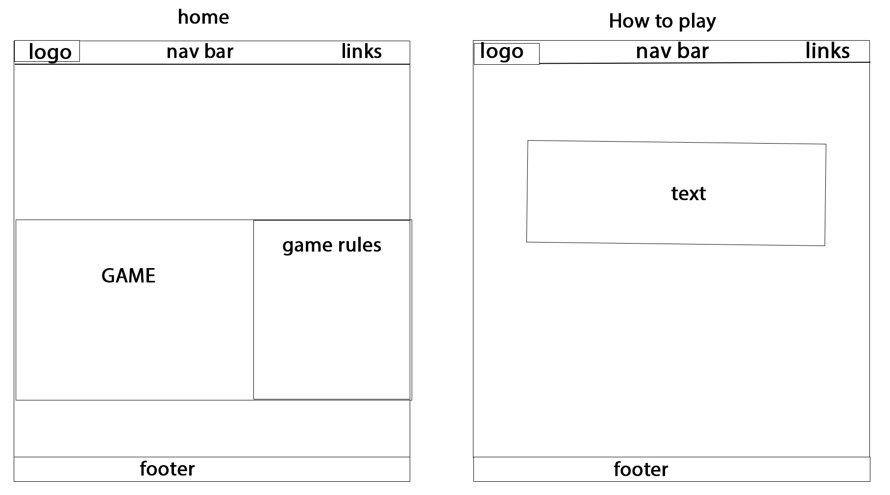
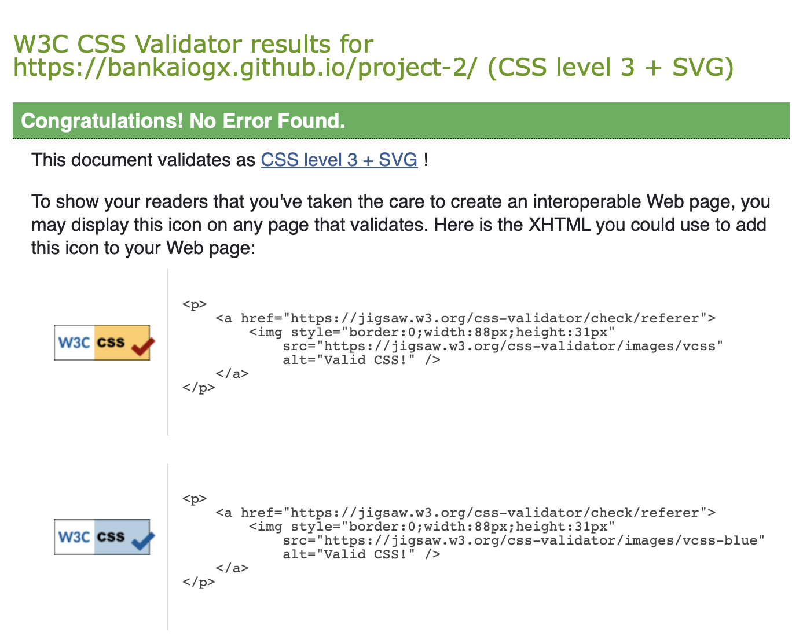
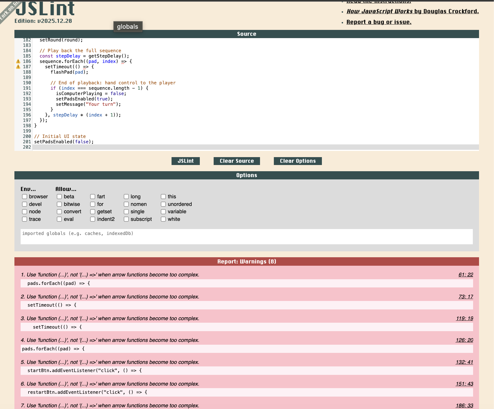
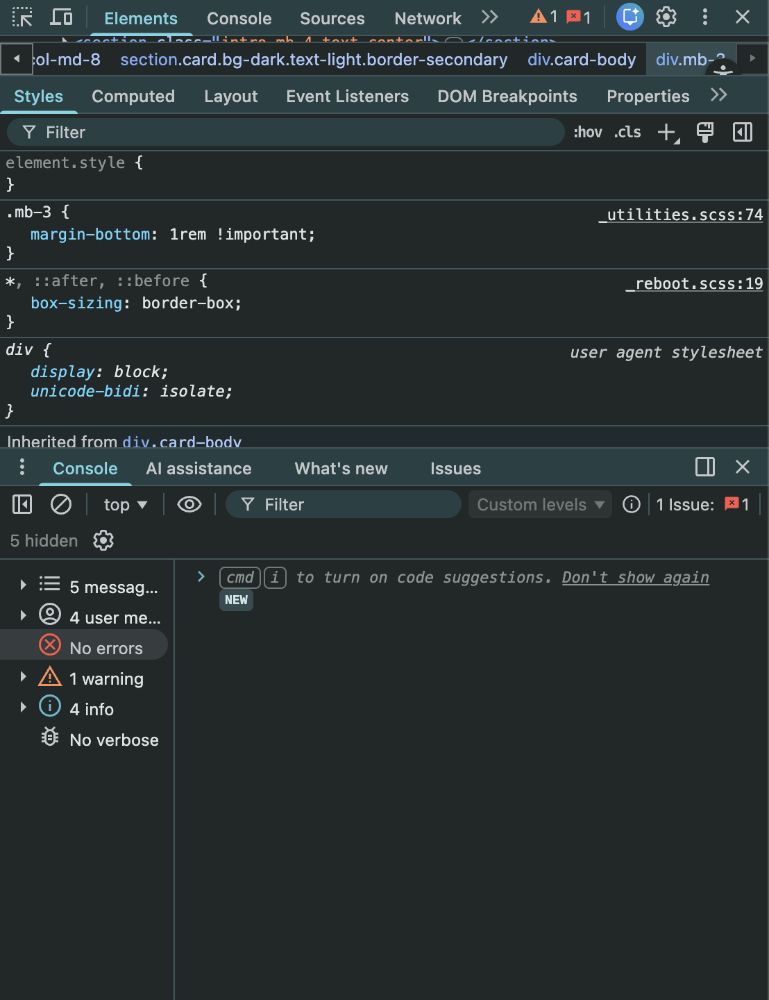

# Sequence Trainer

**Live Site:** https://bankaiogx.github.io/project-2/

## Contents

- [Overview](#overview)
- [Project Goals](#project-goals)
- [Target Audience and User Stories](#target-audience-and-user-stories)
- [UX and Design Process](#ux-and-design-process)
- [Features](#features)
- [Technologies Used](#technologies-used)
- [Testing](#testing)
- [Deployment](#deployment)
- [Version Control and Development Process](#version-control-and-development-process)
- [References](#references)
- [Validation](#validation)
- [Acknowledgements](#acknowledgements)

## Overview

Sequence Trainer is an browser based memory application developed for the Interactive Front End Development assessment. The application challenges users to memorise and repeat a dequence of coloured pads. This ranges in difficulty and provides immediate visual feedback after each interaction.

This project demonstrates the use of front end technologies to create a responsive and interactive eperience whilst ensuring user actions are handled efficiently and consistently.

## Project Goals

The main goals of this project were: 

- To develop an engaging browser based memory game that increases in difficulty as the user progresses.

- To provide clear and immediate visual feed back providing clarity on what is happening during game play.

- to design a responsive interface that works across desktop and mobile screen sizes.

- Consider accessibility by using semantic HTML and visible focus states.

- To meet the assessment criteria by demonstrating JavaScript logic, DOM manipulation and structured organisation.

## Target Audience and User Stories

This application is designed and aimed at casual users who enjoy short logic-based games, as well as users who want to improve memory and concentration skills. It is also suitable for students or individuals who are looking for a lightweigh activity that can be played simply without installation on desktop or mobile devices.

User stories

- As a user, I want to start and restart the game easily so i can play multiple rounds and games.

- As a user, I want to clearly know when it is my turn so i do not make mistakes and i am focusing at the correct time.

- As a user, I want the sequence to change in difficulty as I progress.

- As a user, I want my best score to be saved between sessions.

- As a user, as a keybaord user, i want to navigate and interact with the game without needing a mouse.

- As a user, I want to recieve feedback that is cear when I make a mistake.

## UX and Design Process

The design process focused on creating a simple yet intuitive interface that would be easy for first-time users to understand without instructions or hints.  

Responsiveness was achieved using Bootstrap's grid system and flexible layouts so the inteface adapts cleanly to smaller screens and alrger desktop/tablet displays. Design were reviewed, adjusted and refined during development to ensure the application remained usable, visually conistent and aligned with the original design intentions.

### Visual Theme and Colour Choices

A dark background with bright neon style colours was theme of choice to give the game a modern arcade-like feel whilst ensuring that each pad stands out clearly against the UI. High contrast colours were chosen to help players distinguish between pads quickly, which is essential in a memory based game. Glow effects and brightness changes were added to reinforce which pad is active during playback and hover and to provide immediate visual feedback and confirmation when a user interacts with the game board.

 ### Visual Hierarchy and Layout

 The game board is positioned centrally on the page so that it naturally draws the users attention. Status messages, round counters and the best score display are placed nearby to ensure players can quickly understand the current state of the game. Controls such as Start, Restart and difficulty selection were positioned nearby to reduce unneecessary movement across the screen. 

### Typography

A simple sans-serif font was used throughout the interface to maximise readability on both small and large screens and heading sizes were increased to create a clear information hierarchy whilst body text remained concise to avoid any distraction from the gameplay experience.

### Accessibility Considerations

Accessibility was considered throughout development by using semantic HMTL visible focuc states for keyboard navigation, clear colour contrast and readable text sizes. Buttons were designed to be large enough for touch interaction and status messages were added to communicate whether the user should be watching the sequence or entering input.

### Visual feedback and Interaction Design

Visual feedback is provided through hover states, active pad highlights and message updates that indicate when computer is playing and when its the users turn to input a sequence. Input is temporarily disabled during a state of playback in order to prevent accidental clicks which supports a more defensive design and reduces any potential frustaration

## Features

- Start and restart controls
Allows the user to begin a new game or reset the current session at any time with clear feedback displayed on screen.

- Random Sequence Generation
Each round adds a randomly selected pad to the sequence thus ensuring varied gameplay on every attempt.

- Full Sexquence Playback
The computer replays the entire sequenece at the start of each round so players can memorise the correct order

- Player Input validation
Each user input is checked step-by-step against the computer sequence. An incorrect input immediately ends the game and displays a message.

- Diffculty Settings
Users have the choice between easy, medium and hard, which adjusts the playback speed of the sequence.

- Best Score persistence
The highest round reached is saved using local storage and restored when page is reloaded.

- Defensive Interaction Handling
Pads are disabled whilst the computer is playing to prevent invalid actions and accidental inputs.

- 404 Redirect page
Users who navigate to a non existent URL are redirected back to the main game page

### Future Features

- Sound effects with on/off toggle.
- Animated transaitions between rounds
- Online leaderboards

### Wireframes

Initial wireframes were created to plan the layout and structure of three pages before development began. the designs focued on placing the main game board area prominently in the centre of the screen, with the rules section positioned alongside it on larger displays and stacked verticsally on smaller screens.

A navigation bar were included in the early designs to create a consistent and interactive layout across pages, whilst the how to play page was planned with a large central content area to provide tutorials to clearly explain gameplay instructions

During development, the project was simplified into a single page layout to improve usability and reduce unnecessary navigation whilst keeping core elementds such as strong visual hierarchy, entralised gameplay focus and seperated information areas.

These wireframe helped me guide decisions around spacing, component placement, repsonsiveness and accessibility, esnuring final implementations remained as close to original design intentions.

## Technologies Used

- HTML 5
Used to structure the content of the application and provide semantic markup

- CSS
Used for styling, layout and vsual effects such as neon game design board.

- Bootstrap
Used for responsive layout and grid structure to ensure the interface works across different screen sizes.

- JavaScript 
Used to control the game logic, handle user input, manipulate the DOM, manage timing for sequence playback and store the best score locally.

- Git and GitHub
Used for version control, tracking development progress and hosting the source code repository.

- GitHub Pages
Used to deploy the live version of the application

## Testing

### Manual Testing

| Test Area | Test Case | Steps | Expected Result | Actual Result |
|----------|-----------|-------|----------------|-------------|
| Start Game | Start begins new game | Click **Start** | Round resets and computer plays first sequence | Pass |
| Sequence Playback | Full sequence plays each round | Complete round 1 correctly, continue to round 2+ | Computer replays full sequence each round | Pass |
| Player Input | Correct input progresses | Repeat sequence correctly | Next round begins and message updates | Pass |
| Player Input | Wrong input ends game | Click incorrect pad | Game ends and message displayed | Pass |
| Defensive Design | Input blocked during playback | Click pads while computer is playing | No input accepted | Pass |
| Difficulty | Easy slows playback | Set difficulty to Easy, click Start | Playback is slower | Pass |
| Difficulty | Hard speeds playback | Set difficulty to Hard, click Start | Playback is faster | Pass |
| Restart | Restart resets state | Click Restart | Round resets and pads disabled | Pass |
| Best Score | Best score updates | Beat previous best | Best score changes | Pass |
| Persistence | Best score persists | Refresh page after new best | Best score remains | Pass |
| Responsiveness | Layout adapts to screen | Resize browser window | Layout adjusts cleanly | Pass |
| Keyboard Access | Keyboard usable | Tab + Enter/Space | Controls activate correctly | Pass |
| 404 Redirect | Invalid URL redirects | Visit non-existent page | Redirects to home | Pass |
| JavaScript Disabled | Noscript message shown | Disable JS | Warning message appears | Pass |

### User Story Verification

| User Story | Evidence |
|-----------|---------|
| Start and restart easily | Start and Restart buttons reset and begin games |
| Know when it is my turn | Status message updates clearly |
| Difficulty increases | Sequence length increases each round |
| Difficulty control | Speed changes with difficulty selector |
| Best score saved | Score persists after refresh |
| Keyboard access | Focus states and Enter/Space work |
| Feedback on mistakes | Game over message shown |

### Bugs and Fixes

| Issue | Fix | Result |
|------|-----|-------|
| Difficulty speed unclear | Increased playback delay values | Clearly different speeds |
| Input during playback | Disabled pads during playback | Prevented invalid actions |

## Deployment

The testing was deployed using GitHub Pages.

The following steps were taken:

1. The project was pushed to a GitHub repository.
2. In the repository settings, the Pages section was opened from the sidebar.
3. Deployment was set to Deploy from a branch.
4. The main branch was selected with the root folder (/) as the source.
5. The settings were saved and GitHub generated a live URL for the site.

After deployment, the live site was tested to confrim that all functionaility works as intended, including gameplay, dfficulty selection, score persistence and the 404 redirect page.

The repositoru can be cloned to run the project locally using :

git clone https://github.com/bankaiogx/project-2.git

once cloned, the files can be opened in a code editor and the index.html loaded directly in a browser.

## Version Control and Development Process

GitHub was used throughout the project to maintain version control and track development. A repository was set up at the start of the development and changes were made and committed frequently.

Commit messages were written to give conscise and clear desciption of what had changed such as adding new gameplay logic, updating CSS stylesheet etc.. This helped maintain a clear history of development and made it easier to review the progression and evolution of the project over time.

## References

### Code and Documentation

- Bootstrap
used for the grid system (row, col-*), flex utilities (d-flex, justify-content-*, align-items-*), spacing classes (mb-*, py-*, gap-*), cards, buttons, and form styling.
CDN sources:
https://cdn.jsdelivr.net/npm/bootstrap@5.3.3/dist/css/bootstrap.min.css
https://cdn.jsdelivr.net/npm/bootstrap@5.3.3/dist/js/bootstrap.bundle.min.js
Documentation:
https://getbootstrap.com/

- MDN Web Docs
 referenced for JavaScript syntax, DOM manipulation, event listeners, localStorage, and timing functions such as setTimeout.
https://developer.mozilla.org/

### Game Concept Inspiration

The gameplay concept is inspired by classic pattern-memory games such as Simon. The layout, styling, and JavaScript logic were implemented specifically for this project.

## Validation

### HTML Validation

The live site was tested using the W3C HTML Validator (https://validator.w3.org/).

### CSS Validation

Stylesheets were validated using the W3C CSS Validator (https://jigsaw.w3.org/css-validator/).
No errors were found

### JavaScript Validation

JavaScript was tested using JSLint and the browser developer console.

JSLint reported several stylistic warnings related to arrow function usage; these were reviewed and do not affect gameplay or functionality.

The browser console was checked during gameplay and page reloads, and no runtime errors from the application code were found.

## Acknowledgements